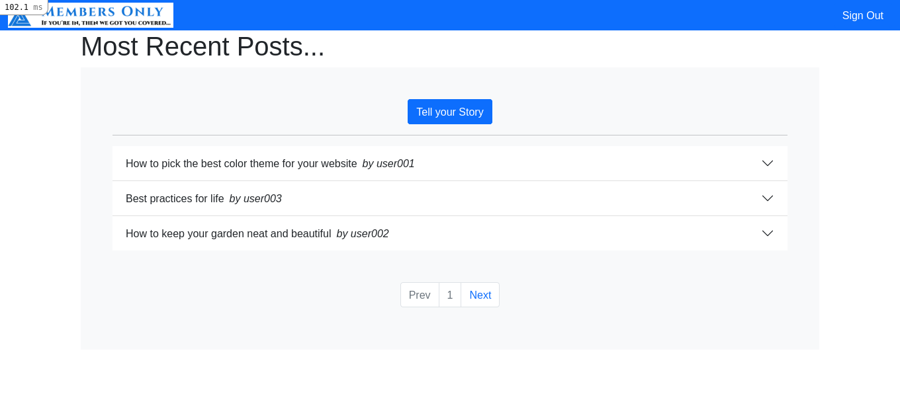

# Members Only

> This is part of the Members Only Project of The Odin Project’s Ruby on Rails Curriculum, which is also part of Microvese's Technical Curriculum. To make it, we followed [these tutorial instructions](https://www.theodinproject.com/paths/full-stack-ruby-on-rails/courses/ruby-on-rails/lessons/authentication).



In this project we built an exclusive _clubhouse_ whose members can write anonymous posts. Inside the clubhouse, however, members can actually see who the author of a post is but, outside, they can only see the story and wonder who wrote it... As they say: _"If you're in, then we got you covered..."_ シ

For this project, we learned about Devise and Bootstrap Gem, to control the Users Table and apply some styles to our views.

## Built With

- Ruby 3.0.0
- Rails 6.1.3.2 (Ruby Gem)
- Sqlite 1.4.2 (Ruby Gem)
- Devise 4.8 (Ruby Gem)
- Bootstrap 5.0.1 (Ruby Gem)

## Getting Started

To get a local copy up and running, please follow these steps:

### Prerequisites

For this project, the following environment should be previously installed on your machine:

- Ruby 3.0.1
- Rails 6.1.3.2
- Node 14.17.0
- Yarn 1.22.10

### Setup

- Go to your terminal bash and, on any directory of your preference, run

```sh
$ git clone git@github.com:JuliCarracedo/members-only.git
```

- Next, run `$ cd members-only` to go into the project root directory.
- Run `$ bundle install` to install all Ruby Gems this project requires.
- And, finally, to prevent any issue that might eventually come up because of webpacker package, run

```sh
$ bundle exec rake webpacker:install
```

### Install

- Run `$ rails db:migrate` to migrate the databases needed to run this project.
- Run `$ rails db:seed` to load some record samples for both Users and Posts Tables. By doing this, you should get 10 sample posts and the following users, out of the box:
  | username | email | password |
  |----------|---------------------|----------|
  | user001 | user001@example.com | Secret1 |
  | user002 | user002@example.com | Secret1 |
  | user003 | user003@example.com | Secret1 |

- Run `$ rails server` to start your local host. You can stop your local server pressing `<ctrl> + c` on your keyboard.
- On the browser of your preference, you can go to http://127.0.0.1:3000/ and you should be able to see the home page which shows all the posts. Now, you can either "Sign in" with one of the previously added users (see list below) or you can "Sign up" with a new user with the "Sign Up" button.

_Important: Please, note that the validations presented below should be taken into account._

- Notice that when you are not logged in, you can't see the Authors of the Posts, as only logged in users can't have this feature!

      User
      - Username:string:unique:length[1..20]
      - email:string:unique:present
      - password:digest:present:length[6..20] (requires, at least, one upcase letter, one downcase letter, and one number)

      Post
      - Title:string:unique:present:length[1...100]
      - Body:text:present:length[minimum: 20]
      - User_id:references

## Authors

👤 **Julian Carracedo**

- GitHub: [@JuliCarracedo](https://github.com/JuliCarracedo)
- Twitter: [@CarracedoTrigo](https://twitter.com/CarracedoTrigo)
- LinkedIn: [Julian Carracedo](https://www.linkedin.com/in/julian-carracedo/)

👤 **Ênio Neves de Souza**

- GitHub: [@enionsouza](https://github.com/enionsouza)
- Twitter: [@enionsouza](https://twitter.com/enionsouza)
- LinkedIn: [Enio Neves de Souza](https://www.linkedin.com/in/enio-neves-de-souza/)

## 🤝 Contributing

Contributions, issues, and feature requests are welcome!

Feel free to check the [issues page](https://github.com/JuliCarracedo/members-only/issues).

## Show your support

Give a ⭐️ if you like this project!

## Acknowledgments

- [Microverse](https://www.microverse.org/)
- [The Odin Project](https://www.theodinproject.com/)
- [Rails Guides](https://guides.rubyonrails.org/index.html)

## 📝 License

This project is [MIT](./LICENSE) licensed.
